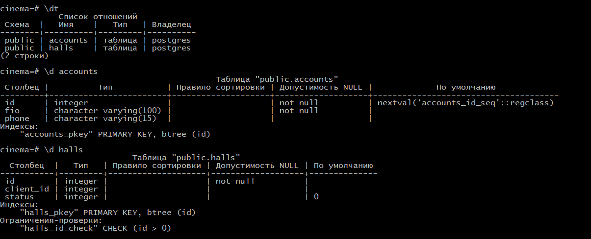

## job4j_cinema

### Описание
Сервис позволяет покупать билеты в кинотеатр. Основан на асинхронных сервлетах и ajax.
Это позволяет видеть какие места свободны, а какие заняты без обновления страницы.

### Технологии
- Java 12
- Java Servlets
- PostgreSQL 10
- jdbc  
- Apache TomCat  
- JS, AJAX, HTML
- maven
- IntelliJ IDEA 

### Функциональность
#### Страница выбора места

#### Страница оплаты

#### Схема базы данных

